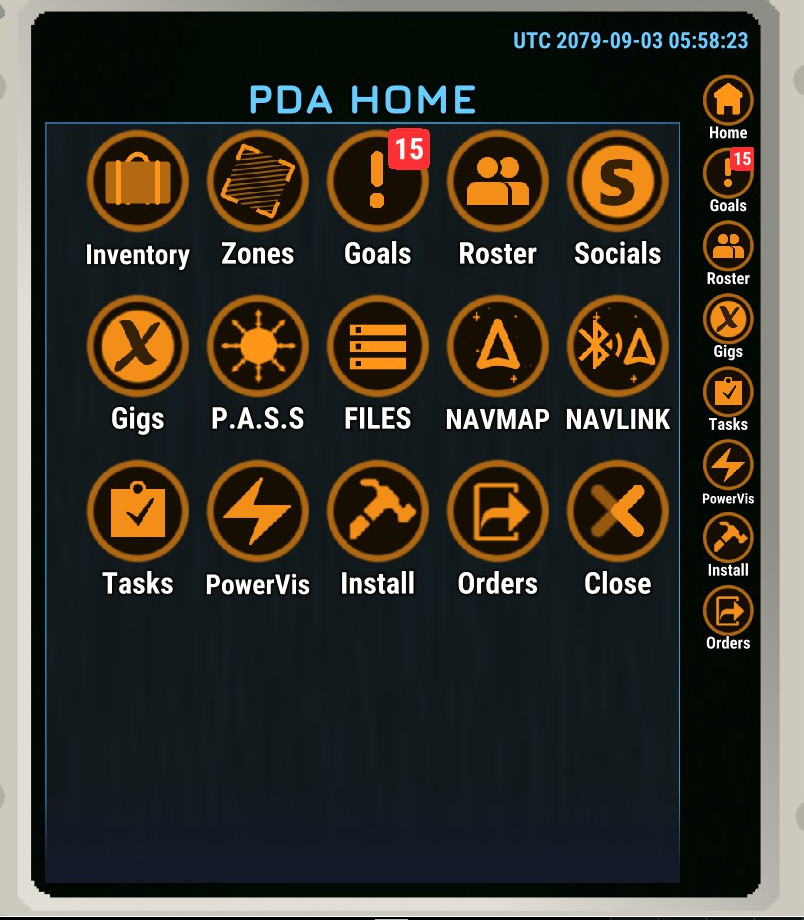

# PDYay

A simple BepInEx plugin to make opening the PDA go to the home screen instead of the task screen.

## Installing

- Download BepInEx v5.4.23.2 WINx64: <https://github.com/BepInEx/BepInEx/releases/tag/v5.4.23.2>

- Unzip all contents into `Ostranauts` root folder. It should contain now `BepInEx`, `winhttp.dll` & etc.

- Unzip the latest mod DLL into `Ostranauts/BepInEx/plugins`. I've packaged each release so that a plugins folder is at the top. You can drag this into your BepInEx folder and confirm overwriting existing files if you're updating. If the plugins folder doesn't exist, that's okay, normally BepInEx creates this folder for you the first time you run the game after installing it but you can also just drop it in from my release and it will work fine

- Launch game and confirm BIE is loading plugins by checking the `Ostranauts/BepInEx/LogInfo.txt` file. You should see the following

```plaintext
[Info   :     PDYay] Plugin PDYay version x.x.x is loaded!
[Info   :     PDYay] Applied PDYay! Patches
```

## Roadmap

- Allow binding the PDA action to any screen

## Media


